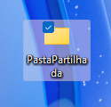
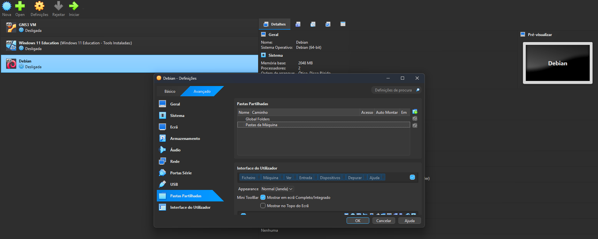
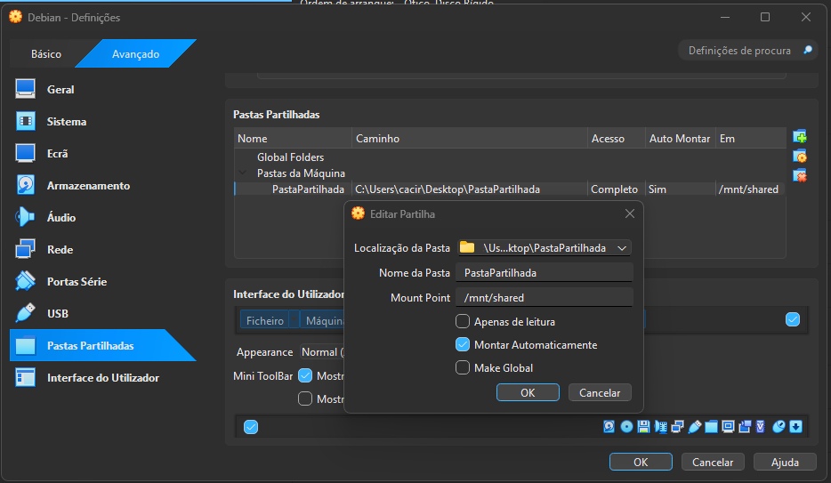
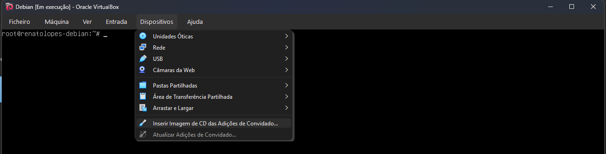
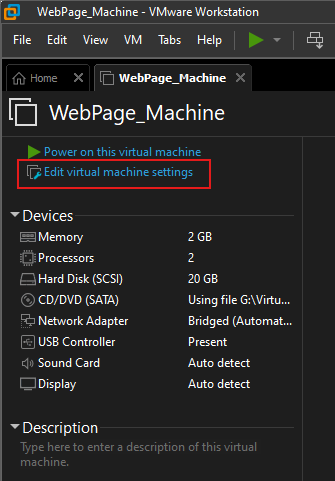
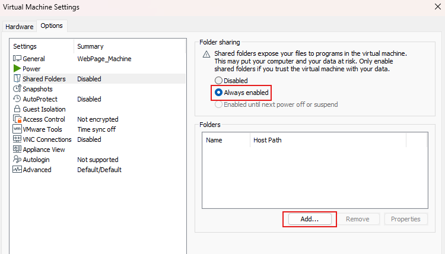
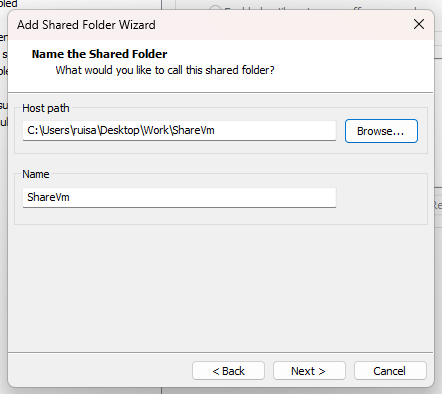
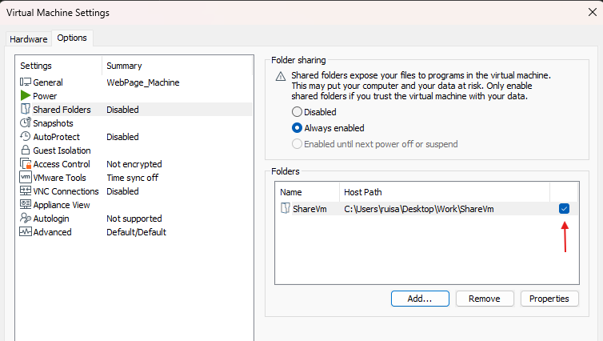

# Pasta Partilhada
Aqui encontram-se as configurações da VM destinadas ao desenvolvimento deste projeto.

Recomenda-se a criação da VM de forma a melhor simular um ambiente de desenvolvimento real num servidor remoto Debian, assim como para encapsular o ambiente separadamente do sistema operativo hóspede. No entanto, se assim o desejar, pode correr este projeto normalmente no Windows, atravez do [Docker Desktop](../README.md/#Como-configurar-o-projeto).

Para isto, é necessária a instalação do Debian num hypervisor da sua escolha.
Os softwares de virtualização suportados de momentos são `VBox` e `VMWare`.

A instalação da máquina é padrão, com um adaptador de rede que permita a comunicação com o *host* para edição do conteúdo ou visualização da página.

## Configurar Pasta Partilhada
Esta secção demostra como configurar uma pasta partilhada entre o Windows (host) e a máquina virtual, de modo a facilitar o desenvolvimento através de editores de texto dedicados, como Visual Studio 2022.

O desenvolvedor necessita apenas de clonar este repositório na pasta partilhada, e todas as alterações feitas do lado do Windows serão visíveis a partir da VM.
- Para VMs hospedadadas em [VBox](#virtualbox)
- Para VMs hospedadadas em [VMWare](#vmware)

### VirtualBox
Para configurar uma pasta partilhada entre o Windows host e a máquina virtual Linux:

1. Crie uma pasta no ambiente de trabalho do Windows host.



2. Abra o VirtualBox, selecione a máquina virtual Debian, e aceda às Definições e Pastas Partilhadas.



3. Dentro do menu Pastas Partilhadas, clique em Pasta da Máquina e no ícone da pasta com o símbolo "+" verde:
    1. No menu Editar Partilha, escolha a pasta a partilhar.
    2. O Nome da Pasta será atribuído automaticamente.
    3. Em Ponto de Montagem (Mount Point), indique o caminho onde será montada a pasta no Linux.
    4. Ative a opção Montar Automaticamente para que a partilha seja montada em cada arranque.



4. Inicie a máquina Debian e entre como utilizador "root".
5. No menu Dispositivos, selecione Inserir imagem de CD dos Guest Additions.



6. Crie as pastas necessárias para a montagem.

```Bash
mkdir /mnt/shared
mkdir /mnt/cdrom
```

7. Monte o CD das Guest Additions com o comando:

```Bash
mount /dev/cdrom /mnt/cdrom
```

8. Verifique o conteúdo da pasta montada:

```Bash
ls -la /mnt/cdrom
```

9. Atualize os repositórios e o sistemas:

```Bash
apt update && apt upgrade -y
```

10. Instale os pacotes necessários:

```Bash
apt install build-essential dkms linux-headers-$(uname -r) -y
```

- **Build-essential**: Metapacote que instala ferramentas básicas de compilação no Linux.
- **dkms**: **Dynamic Kernel Module Support**, recompila automaticamente módulos de kernel (como drivers) após atualizações.
- linux-headers: Ficheiros de cabeçalho necessários para automaticamente módulos compatíveis com o kernel.
- $(uname -r): Retorna a versão exata do kernel em execução.

11. Reinicie a máquina para aplicar todas as alterações:

```Bash
reboot
```

12. Após o arranque, confirme o conteúdo da pasta partilhada:

```Bash
ls /mnt/shared/
```

### VMWare
Para configurar uma pasta partilhada no VMware entre o Windows host e a máquina virtual Linux:

1. Crie uma pasta no ambiente de trabalho do Windows host.


2. Com a máquina virtual desligada, selecione Edit Virtual Machine Settings.



3. Aceda a Options e Shared Folders, e selecione Always Settings.



4. Clique em Add para escolher a pasta a partilhar.



5. Confirme que a pasta aparece listada com a caixa de seleção ativa.



6. Verifique se pacote "open-vm-tools" está instalado (por defeito, costuma vir pré-instalado):

```Bash
vmhgfs-fuse --version
```

```Bash
sudo apt update
sudo apt install open-vm-tools -y
```

7. Crie o diretório de montagem:

```bash
sudo mkdir /mnt/SharedDir
```

8. Edite o ficheiro "/etc/fstab" e adicione a seguinte linha:

```
.host:/         /mnt/SharedDir  fuse.vmhgfs-fuse        defaults,allow_other    0       0
```

9. Guarde e monte o volume:

```bash
sudo systemctl daemon-reload
sudo mount -a
```

10. Confirme que o diretório foi montado corretamente:

```bash
ls /mnt/SharedDir/
```
